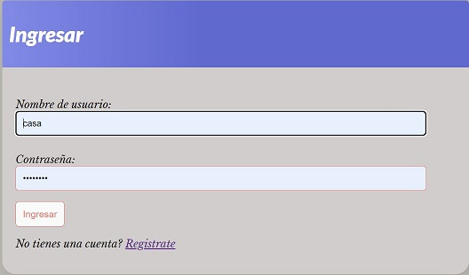

# Mi Primer MVT Django

Ejemplo de MVT para la clase de Coder House python, este codigo contiene:
 - Vistas 
 - Formularios
 - Modelos
 - Templates

**importnante: Este ejemplo fue probado con python  y Django **

## Checkear que tengas Python

Para comenzar primero tienen que asegurarse que tienen instalado, python.

En windows tiene que abrir una terminal cmd o powershell.

```PS
PS C:\> python --version
Python 3.X.X 
```


Si les aparece la versión todo OK pueden seguir. Caso contrario descarguen python desde este [link](https://www.python.org/downloads/).

## Instalar django

En una terminal cmd o powershell desde windows:

```PS
C:\> pip install django
```


Si no arrojo errores esto es suficiente para poder correr el projecto.


```

## Correr el Servidor

Los siguinetes comandos son analogos en Mac/Linux/Windows:


python manage.py migrate
```
La consola mostrara las migraciones de la base de datos que se realizaron.

Luego arrancamos el servidor web

```bash
python manage.py runserver
```
<br/>


<br/><br/>


## video
https://youtu.be/vfRzpacC-N0

# 🌍 Por si deseas contactarme 👨‍💻 :

GRUPO: 

BLADIMIR ANDRADE

BENJAMIN NICIEZA

